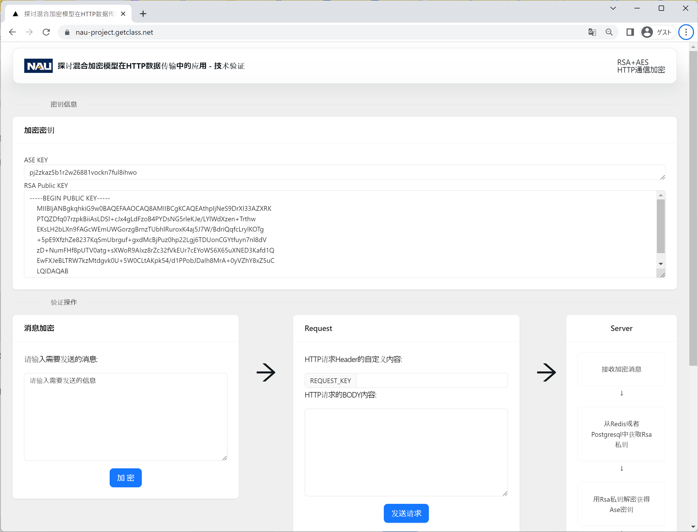

[](https://restorephotos.io/)

## How it works
InfoSecEduSystem is a comprehensive platform designed to bolster information security awareness and knowledge within organizations. It aims to equip employees with the necessary skills and knowledge to protect themselves and their organization from potential cyber threats.

The system serves as an onboarding and continuous training tool, featuring rich educational resources, such as PDF documents, video tutorials, and more. It also integrates regular assessments through monthly quizzes, enabling administrators to monitor employees' learning progress and understanding of information security protocols.

Built using Next.js, React, and Prisma with PostgreSQL for the backend, InfoSecEduSystem offers a seamless, user-friendly experience. It also utilizes AWS S3 for reliable and secure storage of educational resources. Deployed in the cloud, the system promises high availability and minimized maintenance.

With InfoSecEduSystem, we are striving to enhance corporate security postures by fostering a well-informed workforce, thereby minimizing the risk of cyber incidents.

### Google/Neon API key in .env file.

Create a file in root directory of project with env. And store your API key in it, as shown in the .example.env file.

### Installing the dependencies.

```bash
npm install
```

### Running the application.

Then, run the application in the command line and it will be available at `http://localhost:3000`.

```bash
npm run dev
```

## Powered by

This example is powered by the following services:

- [Upload](https://upload.io) (storage)
- [Vercel](https://vercel.com) (hosting, serverless functions, analytics)
- [Auth.js](https://authjs.dev/) + [Neon](https://neon.tech/) (auth + DB)

